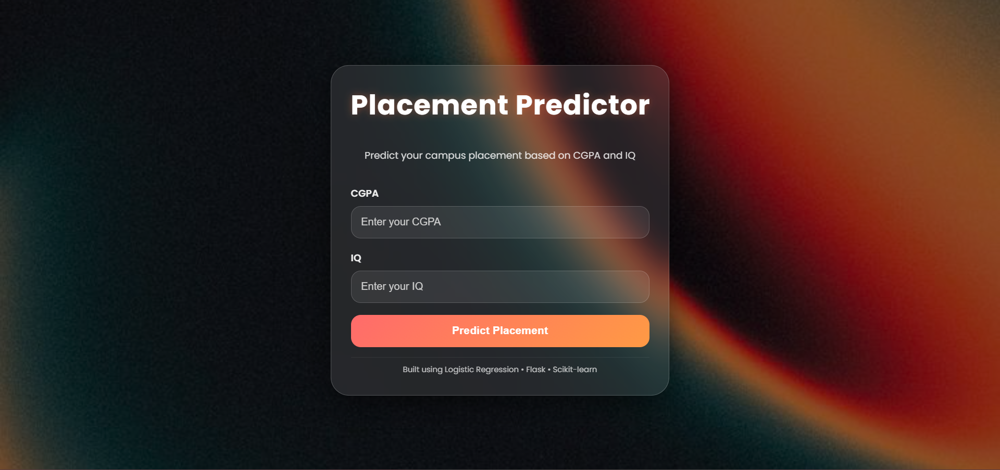
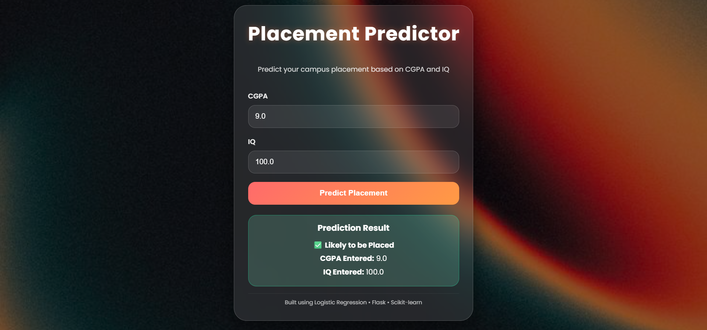
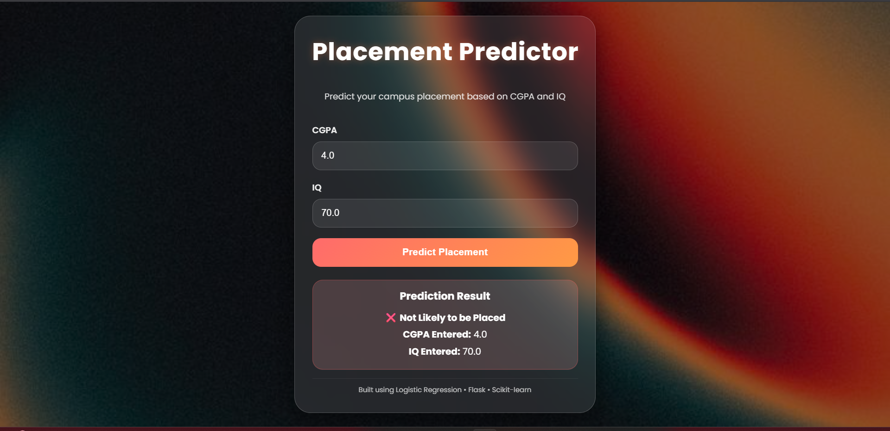

# Placement Predictor

A Machine Learning web application that predicts whether a student is likely to be placed based on their CGPA and IQ.

## 🌐 Live Demo

**Try the application here:**
https://Samanvithaaaaa.pythonanywhere.com

## 📂 GitHub Repository

https://github.com/s-m-nvitha/placement-predictor

## 📌 Project Overview

Placement Predictor is a simple Machine Learning project that predicts a student's placement chances.

The model takes two inputs:

- CGPA
- IQ

It uses a trained **Logistic Regression** model to classify whether a student is likely to be placed or not.

The web interface is built using **Flask** and provides an interactive user experience with a modern glassmorphism design.

---

## ✨ Features

- Predicts placement chances using a Machine Learning model
- Simple and responsive user interface
- Input validation for CGPA and IQ
- Built with Flask and Scikit-learn

---

## 🛠️ Tech Stack

- Python
- Flask
- Scikit-learn
- NumPy
- HTML
- CSS

---

## 🧠 Machine Learning Model

**Algorithm Used**

- Logistic Regression

**Features Used**

- CGPA
- IQ

**Target Variable**

- Placement Status

**Model Accuracy**

- Approximately **90%**

---

## 📂 Project Structure

```text
placement-predictor/
│
├── app.py
├── model.pkl
├── requirements.txt
├── README.md
│
├── templates/
│   └── index.html
│
├── static/
│   ├── style.css
│   └── _3.jpg
│
└── venv/
```

---

## 🚀 ### 1. Clone the repository

```bash
git clone https://github.com/s-m-nvitha/placement-predictor.git

### 2. Navigate to the project folder

```bash
cd placement-predictor
```

### 3. Install the required packages

```bash
pip install -r requirements.txt
```

### 4. Run the Flask application

```bash
python app.py
```

### 5. Open your browser

Visit:

```text
http://127.0.0.1:5000
```

---

## 🚀 Deployment

The application is deployed on PythonAnywhere.

Live Website:
https://Samanvithaaaaa.pythonanywhere.com

## 📸 Screenshots

### 🏠 Home Page


### 🎯 Prediction Result - Placed


### ❌ Prediction Result - Not Placed


---

## 🔮 Future Improvements

- Add more input features
- Improve prediction accuracy
- Enhance the UI
- Store prediction history

---

## 👨‍💻 Author

**Samanvitha R K**

GitHub: https://github.com/s-m-nvitha